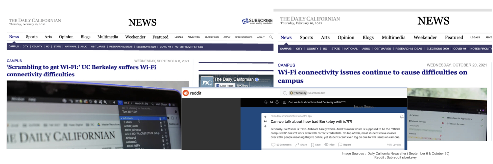
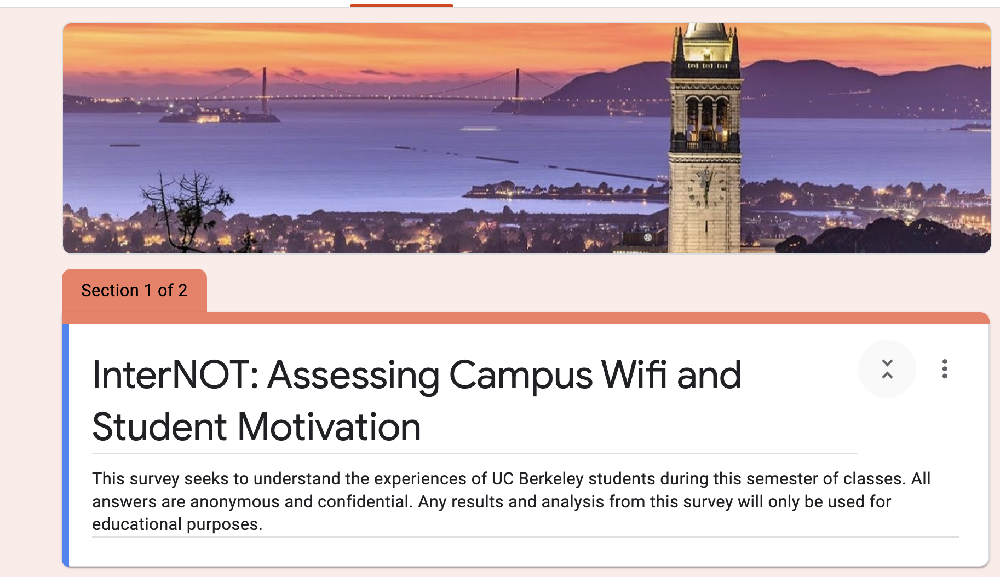
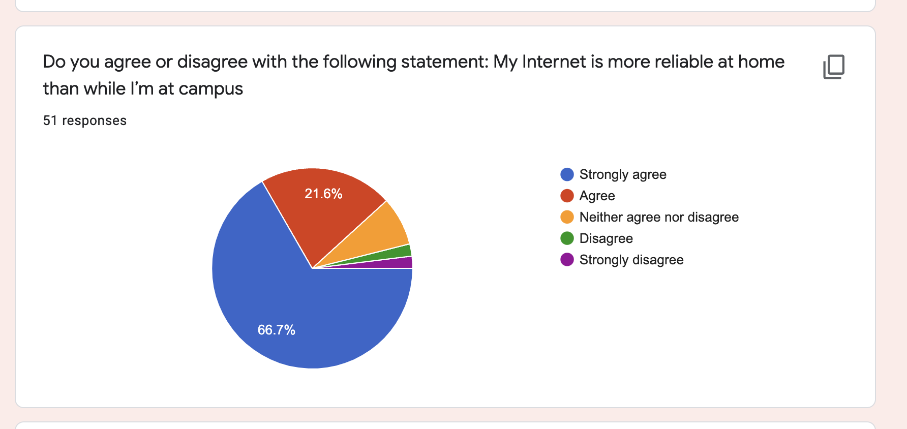
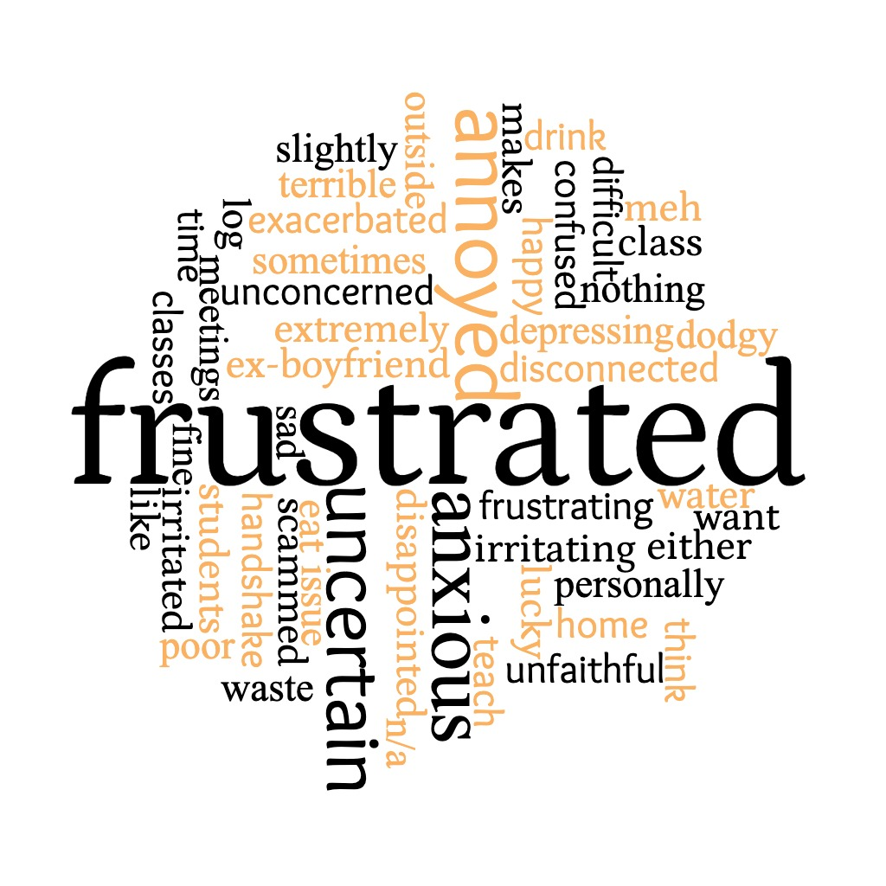

# InterNot

## Introduction: 
UC Berkeley has 2 major wifi available on the campus; Eduroam( Wifi sepcifically for Insitution use) and Calcentral( Open and Public wifi).
The availability of the wifi is oftern limited t inside University building and it's close proximity. However Fall 2021, there was an on-goign issue with 
connecting with connecting to internet through the wifi. This has been acknowledge by Berkeley IT Department.

## Problem Statement: 
This ongoign issue of wifi has been affecting student's access to course material, assignment and for all peripheral activities. 
We wanted to understand how this issue would have an impact on student's motivation and enthusiasm for courses, and how it impacts their enangement.

## Experiment Methodology: 

### Hypothesis: 
 Null Hypothesis- There is no relation between student's motivation with the inability to connect to Internet.  
 Alternate Hypothesis- There is as relation between stundent's motivation with their ability to connect to Internet.

 ### Survey Design :  

Inorder to gauage the impact and gather real-life data points, we approached the gather data through survey experiment.  We asked 10 different types of questions
consist of various type of question(likert style, open ended, binary etc.)  
  Inorder to test our hypothesis we devised question which would be useful to gather information about the two core concepts: 
   1. Internet Connectivity through Campus. 
   2. Student's Motivation, enthusiasm and engangment with course content. 

### Response: 

 These were our key findings: 
 1. Our assumption that their is wifi issue to connect to internet on campus exits 96.1% of our responded they have had faced issue connect to internet and wifi.
 2. Motivation and engagement with course content: 51% student responded to be engaged with the course content.
 3. 33.3% or 1/3 of the respondent had suggested that they didn't feel exicted about learning something new.
 4. 66.7% or 2/3 of the respondent agreed to have better and reliable internet at home than on campus.
 
 ## Conclusion:
 We were able to reject the null hypothesis and found out statistically significant response that their is correlation between campus wifi and
 student's motivation and engagement.
 
 Below was the word cloud of student's major responses: 
 

